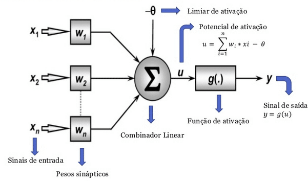

# Rede Neural Perceptron

Foi implementado uma Rede Neural Artificial Perceptron de uma camada no modelo:

    

A rede foi construída baseada no problema de classificação de flores do classico dataset Iris, onde foi limitado a classificação para somente Setosa ou Versicolor.

Para executar, basta compilar em qualquer editor com a versão Python 3 ou mais, além de ter o Pandas também instalado.
